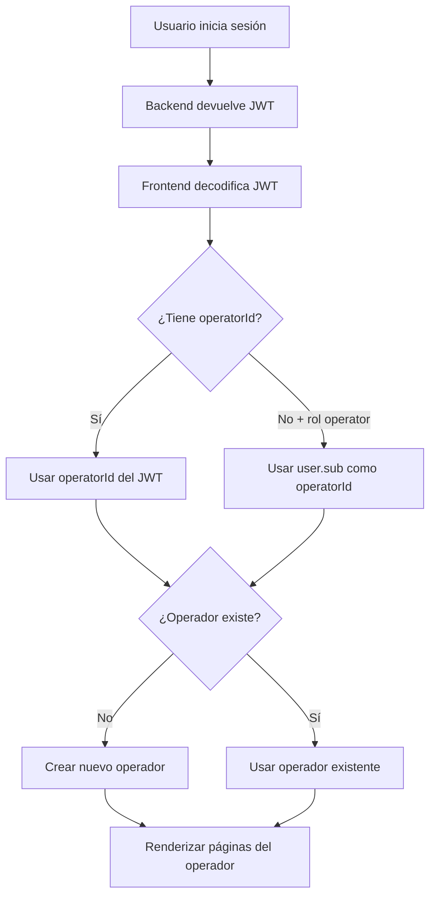

# Configuración del Rol Operator

## Cambios Realizados

### 1. Extracción de `operatorId` del JWT

**Archivo:** `src/services/auth.ts`

Se actualizó la decodificación del JWT para extraer el campo `operatorId`:

```typescript
interface JwtPayload {
  sub: string;
  email: string;
  roles: string;
  operatorId?: string; // ✅ Nuevo campo
  iat: number;
  exp: number;
}
```

**Lógica de fallback:**
- Si el JWT incluye `operatorId`, se usa ese valor
- Si el usuario tiene rol `operator` pero no tiene `operatorId` en el JWT, se usa el `sub` (ID del usuario) como `operatorId`

```typescript
let operatorId = decoded.operatorId;
if (decoded.roles === 'operator' && !operatorId) {
  operatorId = decoded.sub;
}
```

### 2. Creación Automática de Operador

**Archivo:** `src/App.tsx` (líneas 133-171)

Cuando un usuario con rol `operator` inicia sesión:
1. Se verifica si existe un operador con el `operatorId` del usuario
2. Si NO existe, se crea automáticamente un nuevo operador con:
   - ID: `user.operatorId`
   - Nombre: `user.name`
   - Email: `user.email`
   - Configuración por defecto

```typescript
if (user.role === 'operator' && user.operatorId) {
  // Verificar si el operador existe
  const operatorExists = prev.operators.some((op) => op.id === user.operatorId);

  if (!operatorExists) {
    // Crear nuevo operador automáticamente
    const newOperator: Operator = {
      id: user.operatorId,
      name: user.name,
      // ... configuración por defecto
    };
  }
}
```

### 3. Validación de Operador Existente

**Archivo:** `src/App.tsx` (líneas 505-526)

Antes de renderizar las páginas del operador, se verifica que:
1. El usuario tenga un `operatorId`
2. Exista un operador con ese ID en el sistema

Si falta alguna de estas condiciones, se muestra un mensaje de error:

```typescript
const currentOperator = currentOperatorId
  ? appState.operators.find((o) => o.id === currentOperatorId)
  : null;

if (!currentOperatorId || !currentOperator) {
  return (
    <div>
      <h2>Error de Configuración</h2>
      <p>No se encontró un operador asociado a tu cuenta.</p>
    </div>
  );
}
```

### 4. Renderizado de Páginas del Operador

**Archivo:** `src/App.tsx` (líneas 528-592)

Todas las páginas del operador ahora:
- Usan `currentOperator` (validado previamente)
- No necesitan verificar `currentOperatorId` en cada vista
- Filtran datos por `currentOperatorId`

```typescript
return (
  <OperatorLayout currentView={currentView} onNavigate={navigate} userName={currentUser.name}>
    {currentView === 'dashboard' && (
      <OperatorPages.DashboardPage
        operator={currentOperator}
        drivers={appState.drivers.filter((d) => d.operatorId === currentOperatorId)}
        // ...
      />
    )}
    {/* Más vistas... */}
  </OperatorLayout>
);
```

## Debugging

### Console Logs Añadidos

Para facilitar el debugging, se agregaron logs en:

**1. Auth Service (`src/services/auth.ts`):**
```
🔐 JWT Decoded: { sub, email, roles, operatorId, ... }
👤 User role: operator
🏢 Operator ID from JWT: op1
```

**2. App Component (`src/App.tsx`):**
```
🔍 Current User: { id, email, role, operatorId, ... }
📍 Current View: dashboard
🏢 Current Operator ID: op1
📋 Available Operators: [{ id: 'op1', name: '...' }, ...]
```

## Requisitos del Backend

Para que el sistema funcione correctamente, el backend debe:

### Opción 1: Incluir `operatorId` en el JWT

El JWT debe incluir el campo `operatorId` para usuarios con rol `operator`:

```json
{
  "sub": "user-123",
  "email": "operator@example.com",
  "roles": "operator",
  "operatorId": "op1",
  "iat": 1234567890,
  "exp": 1234567890
}
```

### Opción 2: Usar el ID del Usuario

Si el backend NO incluye `operatorId` en el JWT:
- El sistema usará automáticamente el `sub` (ID del usuario) como `operatorId`
- Se creará un nuevo operador automáticamente al iniciar sesión

## Flujo de Inicio de Sesión para Operadores



## Testing

### Caso 1: Operator con `operatorId` en JWT

**Credenciales de prueba:**
- Email: operator@example.com
- Password: (tu contraseña)

**JWT esperado:**
```json
{
  "sub": "user-123",
  "roles": "operator",
  "operatorId": "op1"
}
```

**Resultado esperado:**
- ✅ Usuario se autentica
- ✅ Se asigna `operatorId = "op1"`
- ✅ Se usa el operador existente con ID "op1"
- ✅ Se muestran las páginas del operador

### Caso 2: Operator sin `operatorId` en JWT

**JWT esperado:**
```json
{
  "sub": "user-123",
  "roles": "operator"
}
```

**Resultado esperado:**
- ✅ Usuario se autentica
- ✅ Se asigna `operatorId = "user-123"` (fallback)
- ✅ Se crea un nuevo operador con ID "user-123"
- ✅ Se muestran las páginas del operador

### Caso 3: Admin

**JWT esperado:**
```json
{
  "sub": "admin-123",
  "roles": "admin"
}
```

**Resultado esperado:**
- ✅ Usuario se autentica
- ✅ No se asigna `operatorId`
- ✅ Se muestran las páginas de admin

## Troubleshooting

### Problema: "No se encontró un operador asociado a tu cuenta"

**Causa:** El `operatorId` es `undefined` o no existe en el sistema.

**Solución:**
1. Verificar los logs de consola:
   - ¿Qué muestra "🏢 Operator ID from JWT"?
   - ¿Qué muestra "🔍 Current User"?
   - ¿Qué muestra "📋 Available Operators"?

2. Si `operatorId` es `undefined`:
   - El JWT no incluye `operatorId`
   - El rol del usuario no es `operator`
   - Verificar la configuración del backend

3. Si el operador no existe:
   - Verificar que la creación automática funcionó
   - Revisar los logs "✅ Creando nuevo operador"

### Problema: Las páginas no se renderizan

**Causa:** `currentOperatorId` es `undefined`.

**Solución:**
1. Verificar que el usuario tenga `operatorId` en el objeto `user`
2. Verificar que `currentUser.role === 'operator'`
3. Revisar los logs de consola para ver el estado actual

## Páginas Disponibles para Operadores

1. **Dashboard** (`/dashboard`)
   - Vista general de estadísticas
   - Resumen de conductores, clientes y grupos

2. **WhatsApp** (`/whatsapp`)
   - Conexión de WhatsApp
   - Estado de la conexión

3. **Conductores** (`/drivers`)
   - Lista de conductores
   - Agregar/editar/vetar conductores

4. **Clientes** (`/clients`)
   - Lista de clientes
   - Agregar/vetar clientes

5. **Grupos** (`/groups`)
   - Lista de grupos de WhatsApp
   - Gestión de miembros

6. **Vetados** (`/banned`)
   - Números vetados (conductores y clientes)

7. **Configuración** (`/settings`)
   - Configuración del operador
   - Reglas del bot

---

**Última actualización:** Enero 2026
**Versión:** 1.0
